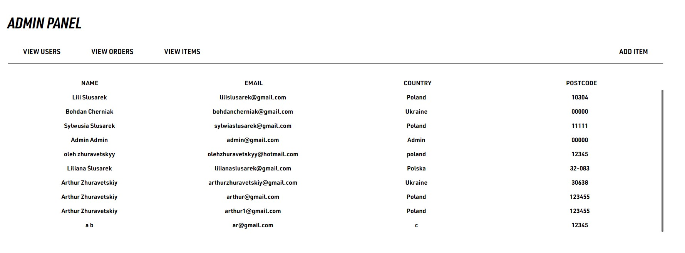
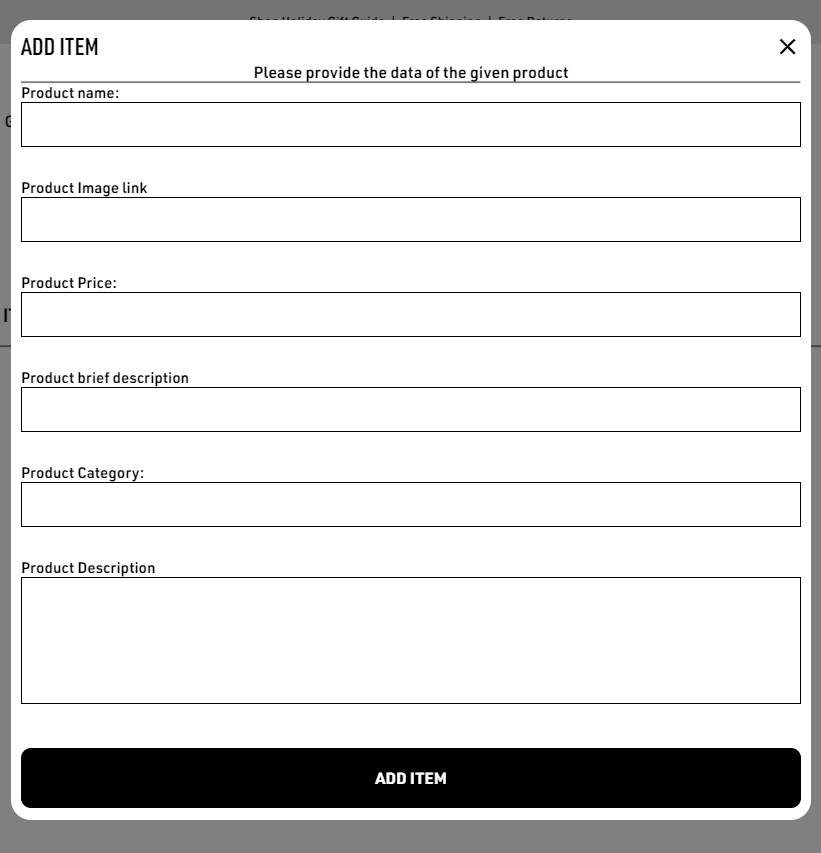

# Clothing Store

The Clothing store is my take on the Arcter'yx website. Its an online store built with modern technologies to provide a seemless shopping experience.

## Frontend
The frontend is developed using ReactJS, a powerful JavaScript library for building user interfaces. Key features include:

- Shopping Cart: smooth and intuitive management of cart items
- User Authentication: Secure login and registration processes.
- Responsivity

## Backend

The backend is powered by NodeJS and ExpressJS, providing a robust and scalable server-side environment. This setup handles:

- API Services: Efficient handling of HTTP requests and responses.
- Authentication: Secure user authentication using JWT.
- Data Management: Operations for products, users, and orders.

## Database
MongoDB is used as the database, offering a flexible and scalable solution for data storage. It supports:

- Product Information: Storage and retrieval of product details.
- User Data: Secure storage of user profiles and credentials.
- Order Processing: Efficient management of orders and inventory.

# Demo

Here is a working live demo: https://clothingbrandfrontend.onrender.com

# Site

## Landing Page

Here you are able to scroll through products, see size availability and set product colors. Other functionality becomes usable once you sign up and log in.
## Sign Up/Sign In

Create and account and head over to the login window. **IMPORTANT Password must be at least 8 symbols long and contain an uppercase letter, lowercase letters, numbers and one special symbols**

Once logged in, your name should appear at the top right corner of the website, like so: 

Now you are able to add products to cart. To do so, click on an Item, then while in the Item window, pick the color of the product and the size:

Once added, the cart should open automatically, showing you the items you have already added and the newly added product. 

Here you can increase the item count by clicking on the plus sign, or on the other hand decrease it by clicking on the minus. You can completely delete the item from your cart by clicking the **X**. And you can click on **Make an Order**, to order the items. These items should then appear on your personal profile. **ACCESS YOUR PROFILE BY CLICKING ON THE HELLO, [YOUR NAME] AT THE TOP RIGHT CORNER**.

### In case you have forgotten your password, you can change it :). Click on *Forgot your password?*

Enter your email and expect some mail. Next open the link and enter the new password:

## Admin Functionality:

Sign in to the admin account by logging in with the following info:

email: admin@gmail.com
Password: Ni@sn2002admin

Then click on the Admin Panel.

This window should open open, from here you can view info about view info about users, orders and your own products.

By clicking on the View Items tab, you can delete or modify every item already present in the store.

By clicking at the top right on the **ADD ITEM** a window will pop up where you can add a new item to your collection.

# Built with

- ReactJS - a powerful JavaScript library for building dynamic and responsive user interfaces with a component-based architecture.
  
- NodeJS - a runtime environment that allows developers to run JavaScript on the server side, enabling scalable and high-performance applications.
  
- MongoDB - a NoSQL database designed for high scalability and flexibility, storing data in a JSON-like format.